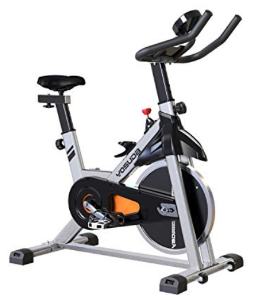
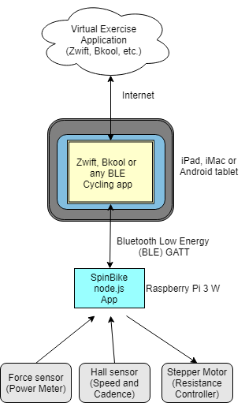

# ble-spinbike
This project is about building a "smart" spinbike from a low-cost, standard spinbike, thus saving a lot of money and having a lot of fun building it and riding it. The result is a spinbike that will work with popular on-line virtual exercise applications, such as Zwift and Bkool. This project was developed specifically using Zwift, but should work with any other product that supports standard Bluetooth GATT technology.

Spinbike is a Javascript node.js application that runs on a Raspberry Pi 3 B+. It gathers data from sensors attached to a spinbike and feeds the data over a bluetooth LE connection to client applications, using the Bluetooth LE (Low Energy) GATT protocol. The GATT protocol is recognized by all major online virtual exercise platforms.

This project provides three of the main exercise bike services: Cadence/Speed, Power and Control. Online apps generally require at least Cadence/Speed or Power in order to allow you to connect and participate. Control is optional, and generally involves feeding the bike information about wind speed, road resistance and grade so it can adjust the effort required by the rider. You can build as much or as little as you want. 

Here is the fritzing diagram for the Raspberry PI, sensors and controllers:

I chose a Yosuda spin bike for this project:

It has three attributes that make it nice for installing the sensors we need, and the optional stepper motor for controlling resistance:

* A magnet on the main drive pulley and a hole just below the crankshaft where a Hall sensor can be mounted for measuring cadence.
* A steering head that is extended below the main frame, providing a perfect location to mount the load cell for measuring the force on the wool brake pad from the front wheel. 
* A flat-sided steering head and a tension shaft located in just the right spot for making it easy to mount the optional stepper motor, which replaces the tension knob and allows for computerized resistance control.

## System Diagram

This is how the software pieces fit together:

Although most cycling applications support ANT as well as Bluetooth LE (hereafter referred to as "BLE"), I chose Bluetooth for a couple reasons:

* We're using a spinbike, which is indoors and stationary. We don't need the robustness of ANT that's better suited for outdoors and real bicycles. 
* We can use conventional, built-in bluetooth devices, thus avoiding the added cost of ANT dongles.

The major components of this project are the spin bike, a tablet (iPad or Android) or smart phone (iphone or Android), a Raspberry Pi, and about $50 in sensors/misc. hardware. You can also use a standard Mac or PC in place of the tablet, but a tablet works better because you can mount it on the handlebars. You do need either a smart phone/tablet or computer that supports Bluetooth 4.0 and thus Bluetooth low energy. 

Although you don't need the latest computer equipment for this, you also can't use antiques. I specify the Raspberry Pi 3 B+ because it has built-in bluetooth. Old iPads won't run the Zwift app. On the other hand, I had no problem using a 2007 iMac. You'll have to experiment.

For situations where you don't have a tablet that has bluetooth LE capability, you can run a bridge application such as "Zwift Companion" on your smart phone that will communicate between your spin bike (our Raspberry Pi computer, actually) and the full-blown Zwift application running on your PC or Mac.

## Parts List

|Part             |Description                 |Price |Link                                              |
|:-----------     |:---------------------------|:-----|:-------------------------------------------------|
|L-001A           |Yosuda Spin Bike            |$250  |https://www.amazon.com/dp/B07D528W98/ref=emc_b_5_t|
|RaspBerry Pi 3 B+|Raspberry Pi|$50|https://www.amazon.com/CanaKit-Raspberry-Power-Supply-Listed/dp/B07BC6WH7V/ref=sr_1_6?keywords=Raspberry+Pi+3+b%2B&qid=1550445668&s=gateway&sr=8-6|
|KY-003 Hall Sensor|Hall Sensor with controller board|$3|https://www.amazon.com/SODIAL-magnetic-sensor-module-Arduino/dp/B077RSV94Z/ref=sr_1_12?keywords=KY-003&qid=1550445829&s=industrial&sr=1-12|
|Flex Coupling|For connecting stepper motor to resistance shaft|$8|https://www.amazon.com/gp/product/B01HBPHSII/ref=ppx_yo_dt_b_asin_title_o07__o00_s00?ie=UTF8&psc=1|
|17HS13-0404S1|Nema 17 stepper motor|$11|https://www.amazon.com/gp/product/B00PNEQ9T4/ref=ppx_yo_dt_b_asin_title_o02__o00_s00?ie=UTF8&psc=1|
|Stepper motor bracket|For attaching stepper motor to steering post|$6.50|https://www.amazon.com/gp/product/B00Q6F51C0/ref=ppx_yo_dt_b_asin_title_o03__o00_s00?ie=UTF8&psc=1|
|L298N|Stepper motor controller|$7|https://www.amazon.com/gp/product/B00CAG6GX2/ref=ppx_yo_dt_b_asin_title_o04__o00_s00?ie=UTF8&psc=1|
|Hx711|Load Cell|$13|https://www.amazon.com/gp/product/B075317R45/ref=ppx_yo_dt_b_asin_title_o05__o00_s00?ie=UTF8&psc=1|
|28 awg 3-conductor wire|3 conductor with ground|$12|https://www.amazon.com/StrivedayTM-3-core-Control-Shielded-Headphone/dp/B01LNH94Y6/ref=sr_1_1?ie=UTF8&qid=1550975991&sr=8-1&keywords=3-conductor+awg+28|
|12 v power supply|For powering stepper motor|$8|https://www.amazon.com/inShareplus-Mounted-Switching-Connector-Adapter/dp/B01GD4ZQRS/ref=sr_1_1?keywords=12+volt+power+supply&qid=1550446643&s=local-services&sr=8-1|
|Buttons|Pushbuttons for controlling resistance|$7|https://www.amazon.com/yueton-Momentary-Button-Switch-Toggle/dp/B0119FH5Z2/ref=sr_1_13?keywords=Pushbutton+switch+momentary&qid=1550448548&s=gateway&sr=8-13|
|Resistor|You only need 1. You probably have some lying around.|$6|https://www.amazon.com/Projects-10EP5122K20-2-2k-Resistors-Pack/dp/B0185FKB2S/ref=sr_1_15?keywords=resistor&qid=1550448604&s=gateway&sr=8-15|

Also:
* Friction tape (works better than plastic electrical tape)
* Duct tape
* iPad or Android tablet
* Keyboard, mouse and monitor for programming Raspberry Pi
* A couple of metal channel brackets and bolts from HD or Lowes for mounting the stepper motor
* Small screws for mounting stepper motor and load cell

## Tools
* Soldering iron
* Rosin-core electical solder
* Small standard and phillips screwdrivers
* Knife and/or wire strippers

# General Procedure

* Configure Raspberry Pi
* Install Spinbike Software
* Connect and test sensors and stepper motor
* Install sensors and stepper hardware to cycle
* Install cycling application
* Test
* Go cycling!

## Configure Raspberry Pi

### Bluetooth Setup

Open a terminal window. Enter the following commands:

1.	sudo systemctl stop bluetooth
2.	sudo systemctl disable bluetooth
3.	sudo systemctl mask bluetooth.service
4.	sudo hciconfig hci0 up   (that’s a zero – not an O)
5.	crontab -e
6.	Add this line:  @reboot sudo -u root hciconfig hci0 up
7.	sudo apt-get install npm
8.	sudo apt-get install bluetooth bluez libbluetooth-dev libudev-dev

## Install Spinbike Software
1.  Open terminal window
2.  cd Desktop
3.  git clone https://github.com/nedatacorp/ble-spinbike.git
4.	cd to the Desktop/ble-spinBike folder
5.  npm install

## Connect and test sensors and stepper motor

The best path to success is to hook up and test each device one at a time, then afer everything is proven to be connected correctly, move the sensors, wiring and other hardware into place for the final assembly and test.

Each device has a JavaScript test script in the Tests folder as well as a Python script in the Python folder that you can use for testing.

### The Load Cell

Mount one end of the load cell to a piece of plywood next to the Pi, using nuts or washers for stand-offs. You need to have some space between the remainder of the load cell and the pywood so you can flex the load cell.

Connect the load cell to the load cell controller, and the load cell controller to the Pi using the Fritzing diagram.

Open a terminal window and cd to the Desktop/ble-spinbike/Tests folder.

Enter:  sudo node forcesensortest.js

You should see the values from the sensor displayed on the screen. If you press on the free end of the load cell, you should see the values increase.

### The Hall Sensor

Wire up the Hall sensor as shown in the Fritzing diagram. Open a terminal window and cd to the Desktop/ble-spinbike/Tests folder.

Enter: sudo node crankspeedtest.js

Pass a magnet close to the transistor on the Hall sensor board. You should see a "Count: " message displayed on the screen, with the number incrementing each time you pass the magnet close to the sensor.

### The stepper Motor

Connect the stepper motor to the stepper motor controller, and the controller to the Pi using the Fritzing diagram as a guide.

Connect a 12v, 2 amp DC power supply to the stepper motor controller and plug it in. The LED on the controller board should light up.

From a terminal window, cd to the Desktop/ble-spinbike/Tests folder.

Enter: sudo node steppertest.py

The stepper motor should run 360 degrees clockwise and then 360 degrees counter-clockwise.

