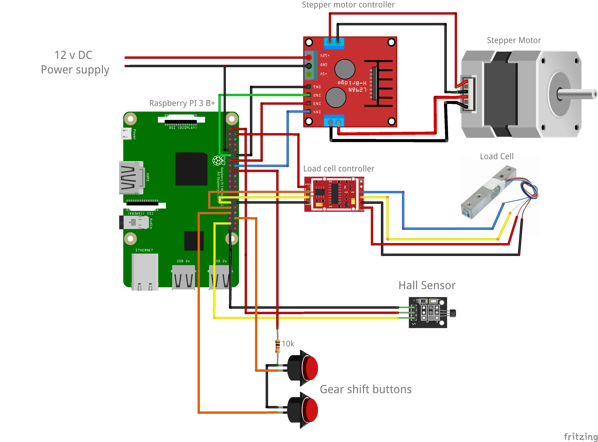

# ble-spinbike
Javascript/node.js solution for adapting spin bikes to work with on-line virtual cycling applications, such as Zwift and Bkool.

Spinbike is a Javascript node.js application that runs on a Raspberry Pi 3 W. It gathers data from sensors attached to a spinbike and feeds the data over a bluetooth LE connection to client applications, using the Bluetooth LE (Low Energy) GATT protocol. The GATT protocol is recognized by all major online virtual exercise platforms.

Here is the fritzing diagram for the Raspberry PI, sensors and controllers:

